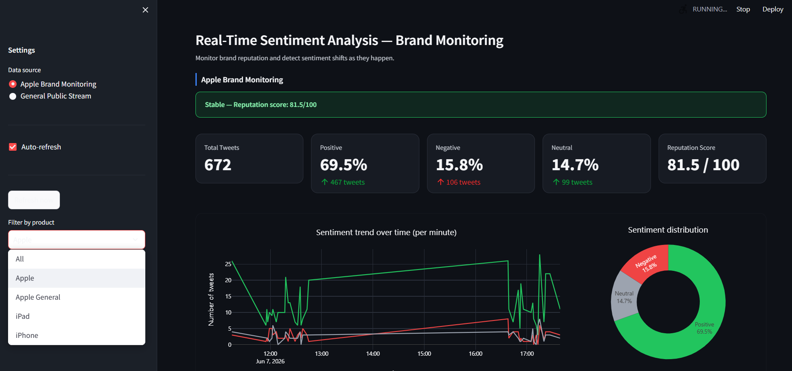
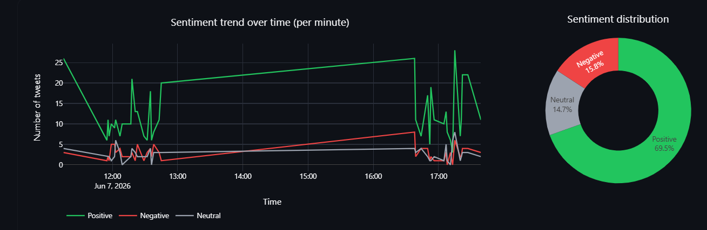
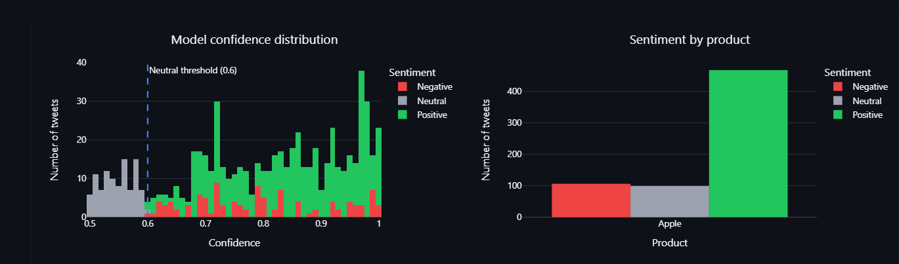
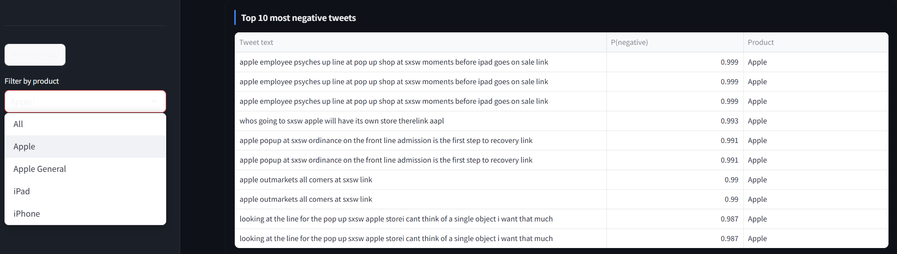
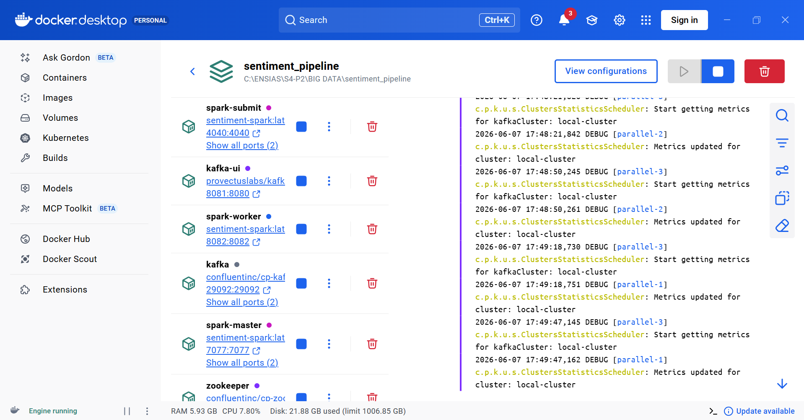
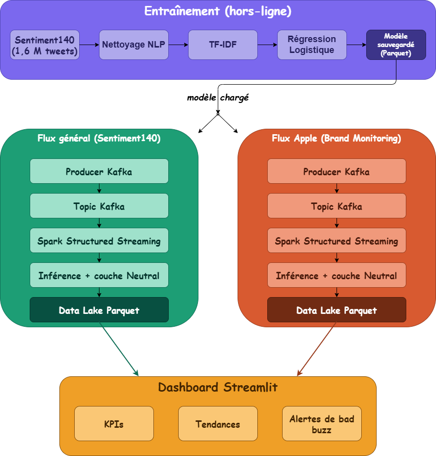
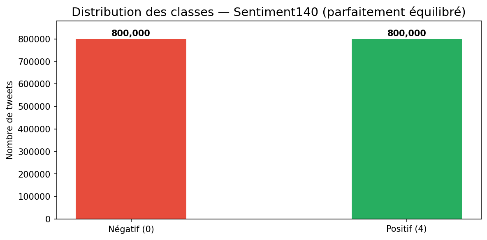
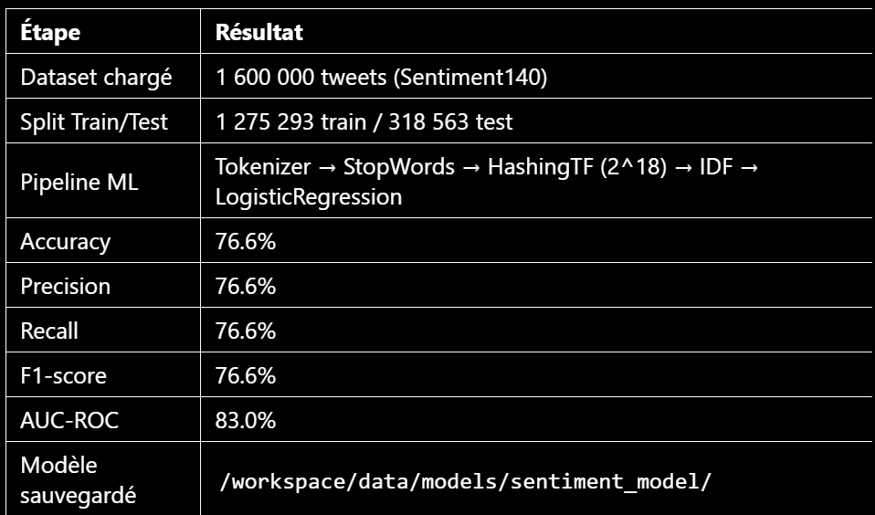

# Real-Time Sentiment Analysis — Big Data Pipeline

> Kafka · Spark Structured Streaming · MLlib · Parquet · Streamlit
> Surveillance de la réputation d'une marque à partir de flux de tweets en temps réel.

---

## Sommaire

1. [Aperçu](#aperçu)
2. [Captures d'écran — Dashboard](#captures-décran--dashboard)
3. [Architecture du pipeline](#architecture-du-pipeline)
4. [Stack technique](#stack-technique)
5. [Datasets](#datasets)
6. [Résultats du modèle](#résultats-du-modèle)
7. [Notebooks & figures](#notebooks--figures)
8. [Démarrage rapide — visualiser le dashboard](#démarrage-rapide--visualiser-le-dashboard)
9. [Structure du projet](#structure-du-projet)

---

## Aperçu

Le projet construit une chaîne complète de traitement Big Data pour l'analyse de sentiment :

1. **Entraînement hors-ligne** d'un modèle de classification (Régression Logistique + TF-IDF) sur 1,6 million de tweets annotés (Sentiment140).
2. **Streaming temps réel** : ingestion de tweets via Kafka, inférence du modèle dans Spark Structured Streaming, écriture des prédictions dans un Data Lake Parquet.
3. **Surveillance de marque** : un flux dédié de tweets mentionnant Apple est analysé en continu et visualisé dans un dashboard Streamlit (KPIs, tendance du sentiment, alertes de "bad buzz").

---

## Captures d'écran — Dashboard

**Vue d'ensemble** — statut de la marque et indicateurs clés



**Tendance du sentiment et répartition globale**



**Distribution de la confiance du modèle et répartition par produit**



**Tweets les plus négatifs**



**Stack applicative en cours d'exécution (Docker Desktop)**



---

## Architecture du pipeline



### Couche métier "Neutral"

Le modèle est binaire (positif / négatif). Une couche de post-traitement reclasse une prédiction en **Neutral** lorsque la confiance du modèle est faible :

```
confiance = max(P(positif), P(négatif))

confiance < seuil       → Neutral
confiance ≥ seuil, label positif → Positive
confiance ≥ seuil, label négatif → Negative
```

### Détection de "bad buzz"

```
taux_négatif = négatifs / (positifs + négatifs)   [neutres exclus]

taux_négatif > seuil sur la fenêtre récente → alerte
```

---

## Stack technique

| Composant | Rôle |
|---|---|
| **Apache Kafka** | Ingestion et messagerie temps réel |
| **Apache ZooKeeper** | Coordination et gestion des métadonnées du cluster Kafka |
| **Kafka UI** | Interface web de supervision des topics et messages Kafka |
| **Apache Spark (Structured Streaming + MLlib)** | Traitement batch et streaming, entraînement et inférence |
| **Apache Parquet** | Data Lake colonnaire (modèle, prédictions, métriques) |
| **Streamlit + Plotly** | Dashboard de visualisation interactif |
| **Docker / Docker Compose** | Orchestration de la stack (ZooKeeper, Kafka, Kafka UI, Spark master/worker) |
| **Python** | Langage principal (producers, configuration, dashboard) |

---

## Datasets

| | Sentiment140 | Apple Tweets |
|---|---|---|
| Volume | ~1 600 000 tweets | ~9 000 tweets |
| Rôle | Entraînement du modèle + flux de démonstration à grande échelle | Cas d'usage métier : surveillance de la marque Apple |
| Source | Stanford — Sentiment140 | Kaggle — Apple Twitter Sentiment Dataset |

> Les fichiers bruts ne sont pas versionnés (voir `.gitignore`) : à télécharger séparément et à placer dans `data/raw/`.

---

## Résultats du modèle

Dernière évaluation sur le jeu de test (`src/evaluate_model.py`, métriques sauvegardées dans `data/metrics/sentiment_metrics.parquet`) :

| Métrique | Valeur |
|---|---|
| Accuracy | 0.766 |
| Precision | 0.766 |
| Recall | 0.766 |
| F1-score | 0.766 |
| AUC-ROC | 0.830 |

Matrice de confusion (jeu de test) :

| | Prédit négatif | Prédit positif |
|---|---|---|
| **Réel négatif** | 119 880 (TN) | 39 875 (FP) |
| **Réel positif** | 34 675 (FN) | 124 133 (TP) |

---

## Notebooks & figures

| Notebook | Contenu |
|---|---|
| `01_exploration_sentiment140.ipynb` | Exploration et qualité des données, distribution des classes |
| `02_preprocessing_sentiment140_pyspark.ipynb` | Nettoyage NLP, tokenisation, TF-IDF |
| `03_training_model_spark_mllib.ipynb` | Entraînement du modèle, métriques d'évaluation |

**Distribution des classes (Sentiment140)**



**Métriques d'entraînement**



---

## Démarrage rapide — visualiser le dashboard

Pipeline complet pour faire tourner l'application et observer le dashboard en conditions réelles. Toutes les commandes sont à exécuter depuis la racine du projet, sous PowerShell (Windows + Docker Desktop).

### 1. Démarrer la stack Docker (Kafka + Spark)

```powershell
docker-compose build                              # première fois uniquement
docker-compose up -d
docker-compose --profile tools up -d spark-submit
docker-compose ps                                 # vérifier que tout est "running"
```

### 2. Créer les topics Kafka (première fois uniquement)

```powershell
docker exec kafka kafka-topics --create --bootstrap-server localhost:9092 --topic sentiment_stream --partitions 4 --replication-factor 1 --if-not-exists
docker exec kafka kafka-topics --create --bootstrap-server localhost:9092 --topic apple_tweets --partitions 1 --replication-factor 1 --if-not-exists
docker exec kafka kafka-topics --list --bootstrap-server localhost:9092   # doit lister les deux topics
```

### 3. Préparer le modèle (si `data/models/sentiment_model/` est vide)

```powershell
docker exec spark-submit python src/preprocessing.py
docker exec spark-submit python src/train_model.py --sample 0.1   # version rapide pour test
```

### 4. Lancer les consumers Spark Streaming (un terminal par commande)

```powershell
# Terminal A
docker exec spark-submit python src/spark_streaming_consumer_sentiment140.py

# Terminal B
docker exec spark-submit python src/spark_streaming_consumer_apple.py
```

### 5. Lancer les producers Kafka (environnement Python local, venv activé)

```powershell
# Terminal C
.\venv\Scripts\activate
python src/kafka_producer_sentiment140.py --max-rows 50000

# Terminal D
.\venv\Scripts\activate
python src/kafka_producer_apple.py --loop
```

### 6. Lancer le dashboard

```powershell
# Terminal E
.\venv\Scripts\activate
streamlit run dashboard/app.py
```

Ouvrir ensuite **http://localhost:8501**. Le dashboard se rafraîchit automatiquement et affiche les KPIs, la tendance du sentiment et les alertes dès que les fichiers Parquet sont alimentés par les consumers.

> Guide détaillé avec dépannage : [`docs/GUIDE_WINDOWS_DOCKER.md`](docs/GUIDE_WINDOWS_DOCKER.md)

---

## Structure du projet

```
sentiment_pipeline/
│
├── notebooks/
│   ├── 01_exploration_sentiment140.ipynb          # Exploration et qualité des données
│   ├── 02_preprocessing_sentiment140_pyspark.ipynb # Nettoyage NLP, TF-IDF (PySpark)
│   └── 03_training_model_spark_mllib.ipynb        # Entraînement et évaluation du modèle
│
├── src/
│   ├── utils.py                                   # Fonctions partagées (nettoyage, UDFs, logger…)
│   ├── preprocessing.py                           # Pipeline NLP batch
│   ├── train_model.py                             # Entraînement du modèle (TF-IDF + Régression Logistique)
│   ├── evaluate_model.py                          # Évaluation : métriques, matrice de confusion
│   ├── kafka_producer_sentiment140.py             # Producer Kafka — flux Sentiment140
│   ├── kafka_producer_apple.py                    # Producer Kafka — flux Apple
│   ├── spark_streaming_consumer_sentiment140.py   # Consumer Spark Streaming — flux Sentiment140
│   └── spark_streaming_consumer_apple.py          # Consumer Spark Streaming — flux Apple
│
├── dashboard/
│   └── app.py                                     # Application Streamlit (visualisation temps réel)
│
├── config/
│   └── config.py                                  # Configuration centralisée (chemins, seuils, Spark, Kafka)
│
├── data/                                          # Data Lake — non versionné (voir .gitignore)
│   ├── raw/                                       # CSV bruts (Sentiment140, Apple Tweets)
│   ├── processed/                                 # Données nettoyées (Parquet)
│   ├── models/sentiment_model/                    # Modèle MLlib entraîné et sérialisé
│   ├── streaming/
│   │   ├── sentiment140_predictions/              # Prédictions du flux Sentiment140
│   │   └── apple_predictions/                     # Prédictions du flux Apple
│   └── metrics/                                   # Métriques d'évaluation (Parquet)
│
├── docs/
│   ├── GUIDE_WINDOWS_DOCKER.md                    # Guide d'exécution détaillé (Windows + Docker)
│   ├── figures/                                   # Graphiques générés par les notebooks
│   │   └── class_distribution.png
│   └── screenshots/                               # Captures d'écran du dashboard (à compléter)
│
├── scripts/                                       # Scripts utilitaires
├── docker-compose.yml                             # Stack Kafka + Spark (Zookeeper, Kafka, Spark master/worker)
├── Dockerfile                                     # Image Spark personnalisée (sentiment-spark)
├── requirements.txt                               # Dépendances Python — environnement local / Streamlit
├── requirements-spark.txt                         # Dépendances Python — conteneurs Spark
├── .gitignore
└── README.md
```


---

*Projet Big Data — Pipeline d'analyse de sentiment en temps réel.*
